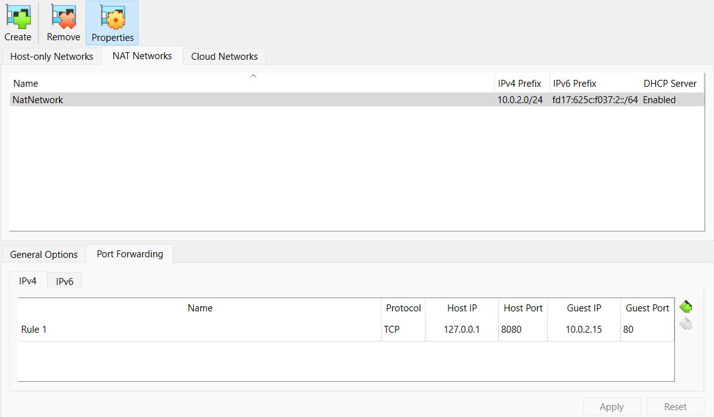

# Phishing Simulation Campaign

## Description
This project involves creating a phishing site hosted on an Apache Web Server running on an Ubuntu Virtual Machine. The goal is to simulate real-world phishing attacks to demonstrate how attackers steal credentials. Additionally, it highlights the importance of Multi-Factor Authentication (MFA) in mitigating phishing threats. The phishing webpage showcases how credentials can be captured by attackers, emphasizing the need for enhanced security measures.

## Technologies Used
- **HTML / CSS**
- **PHP**
- **VirtualBox**
- **Apache Web Server**

## Walkthrough
### 1. Setting Up the Virtual Environment
The first step involved setting up an Ubuntu Virtual Machine (VM) in VirtualBox. The VM was configured with a NAT network and port forwarding enabled.



### 2. Installing Apache Web Server
To host the phishing webpage, Apache was installed on the Ubuntu VM using the following command:

```bash
sudo apt install apache2
```

### 3. Hosting the Webpage
After installation, the phishing webpage files were moved to the Apache web server's root directory:

```bash
 /var/www/html/
```

The Apache web server was then started:

```bash
sudo systemctl start apache2
```

### 4. Accessing the Phishing Page
Once the setup was complete, the phishing page was accessible from the host machine through the browser.


### 5. Credential Capture Mechanism
When a user enters their credentials on the login page and submits the form, they are redirected to a generic success page. However, in the background, the [PHP script](Webpage/Capture.php) silently stores the credentials without the user's knowledge.


## Key Learnings
- Understanding the mechanics of phishing attacks and how attackers capture credentials.
- The role of Apache and PHP in setting up and running phishing campaigns.
- The importance of Multi-Factor Authentication (MFA) in protecting user accounts from credential theft.
- Ethical considerations and security best practices to prevent phishing attacks.

## Disclaimer
This project is strictly for educational purposes and cybersecurity awareness. Unauthorized use of phishing techniques for malicious purposes is illegal and unethical.
